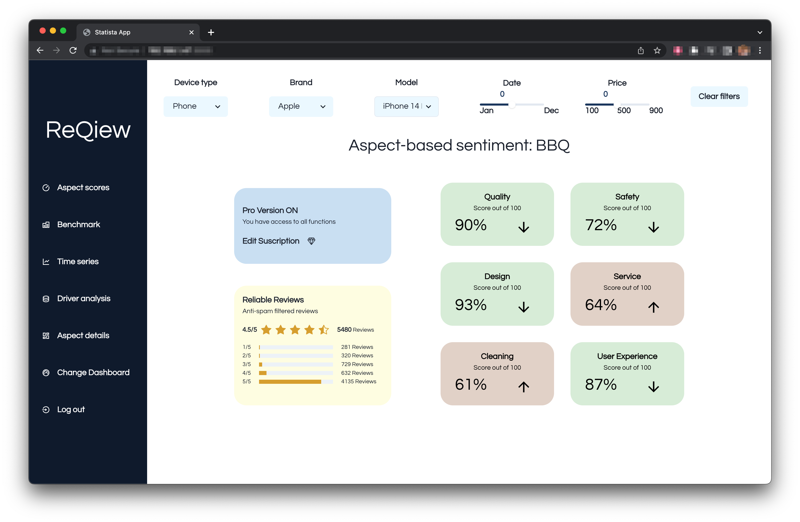
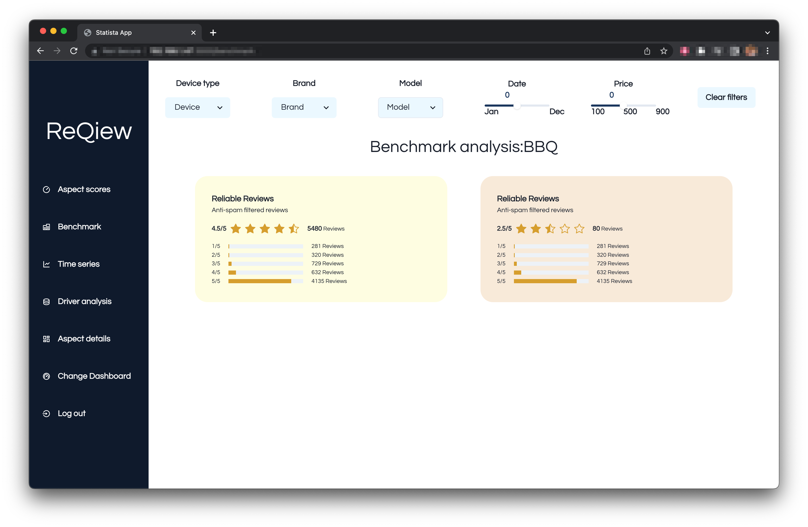

# ⭐ REQIEW Protype 

## Pages

1. Aspect Scores
2. Benchmark





## Instructions

When cloning the project run:
```bash
npm install
```
## Scripts

- To start the project run:
```bash
npm run start
```
The proyect will run on **PORT 3000**.

## Technologies

<p align="center">


</p>